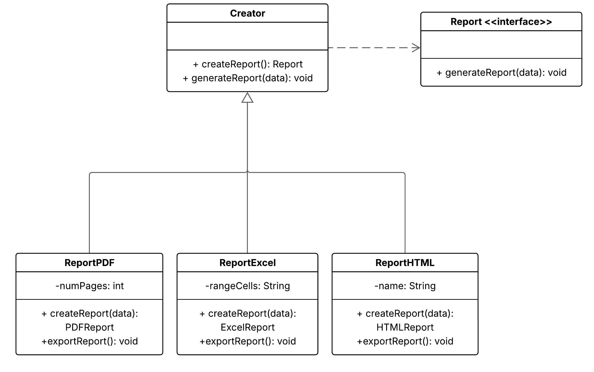
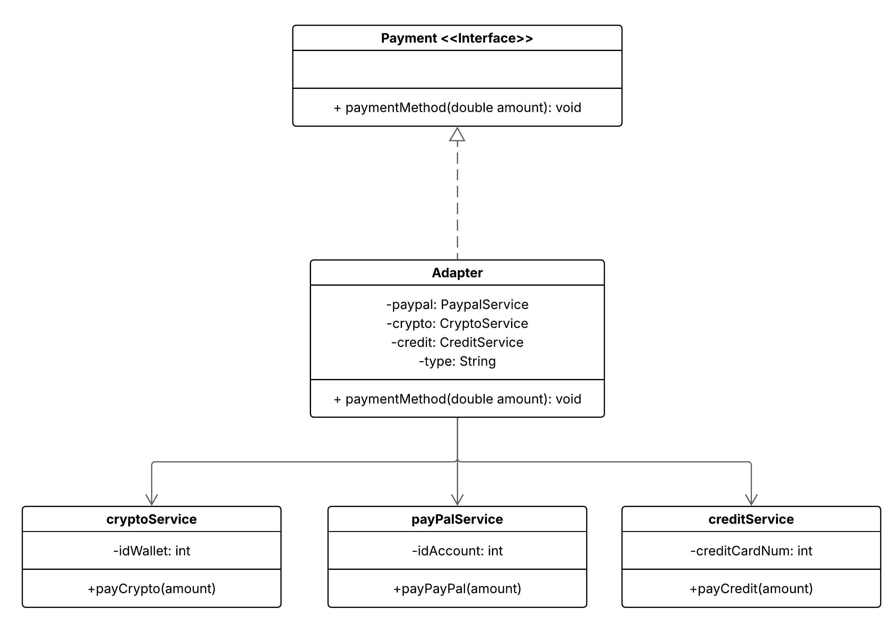
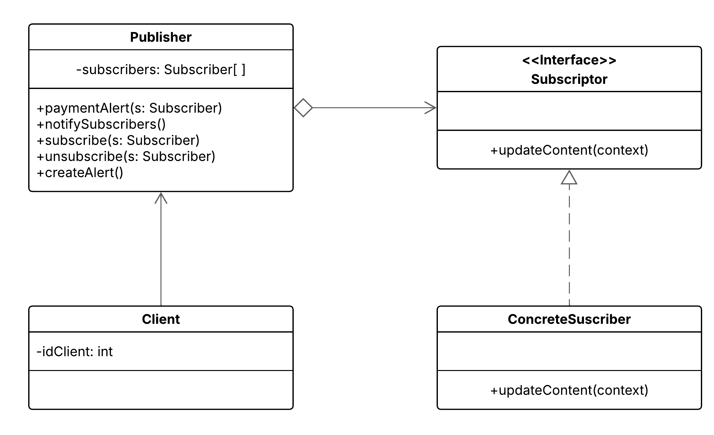

# Readme generado con ayuda de copilot

Este repositorio contiene implementaciones de patrones de diseño (creacionales, estructurales y comportamentales) con ejemplos y diagramas de clases. A continuación se describen las implementaciones incluidas, su situación práctica y el diagrama de clases correspondiente.

## Patrón Creacional — Factory Method

Situación:
Imagina que tu aplicación debe generar múltiples tipos de reportes:
- PDF para documentos formales,
- Excel para reportes numéricos y análisis de datos,
- HTML para visualización rápida en la web.

Requerimiento:
Según la necesidad del usuario, el sistema debe poder producir cualquiera de estos formatos sin necesidad de modificar la lógica central de negocio.

Descripción de la implementación:
- Product (Reporte): Interfaz o clase abstracta que define la operación común a todos los reportes, por ejemplo `generar()`.  
- ConcreteProduct (ReportePDF, ReporteExcel, ReporteHTML): Implementaciones concretas de reportes que realizan la generación específica del formato.
- Creator (GeneradorReporte): Clase abstracta que declara un método factory `crearReporte(tipo)` que devuelve un `Reporte`.
- ConcreteCreator (GeneradorReporteConcreto): Implementaciones del creador que instancian productos concretos según el tipo solicitado por el cliente.

Diagrama de clases:

---

## Patrón Estructural — Adapter

Situación:
Tu aplicación debe integrar un sistema de pago que ofrece múltiples métodos:
- Tarjeta de crédito,
- PayPal,
- Criptomonedas.

Problema:
Cada método fue desarrollado de manera independiente y expone una interfaz distinta. Necesitas que todos los métodos de pago se comporten de forma unificada dentro de tu aplicación, sin modificar el código original de cada servicio externo.

Descripción de la implementación:
- Target (IPago): Interfaz que espera la aplicación para procesar pagos, p. ej. `procesarPago(monto)`.  
- Adaptee (APIServicioTarjeta, ServicioPayPal, ServicioCrypto): APIs externas con interfaces incompatibles.
- Adapter (AdaptadorPago): Clases adaptadoras que implementan `IPago` y traducen las llamadas a la interfaz de las APIs externas.

Diagrama de clases:

---

## Patrón Comportamental — Observer

Situación:
Tienes un sistema de notificaciones que debe enviar alertas (por ejemplo: “nuevo mensaje”, “pedido enviado”, “saldo bajo”) a múltiples usuarios suscritos.
Los usuarios pueden suscribirse o cancelar su suscripción dinámicamente, y cada alerta debería propagarse automáticamente a todos los suscriptores interesados sin acoplar fuertemente el emisor con los receptores.

Descripción de la implementación:
- Subject (Sujeto/Notificador): Mantiene una lista de observadores y provee métodos para añadir/quitar suscriptores y para notificar cambios.
- Observer (Suscriptor): Interfaz que define el método `actualizar(evento)` que reciben las notificaciones.
- ConcreteObserver (UsuarioSuscrito): Implementaciones concretas que reaccionan a las notificaciones.

Diagrama de clases:

